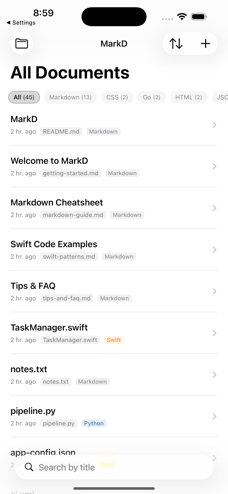
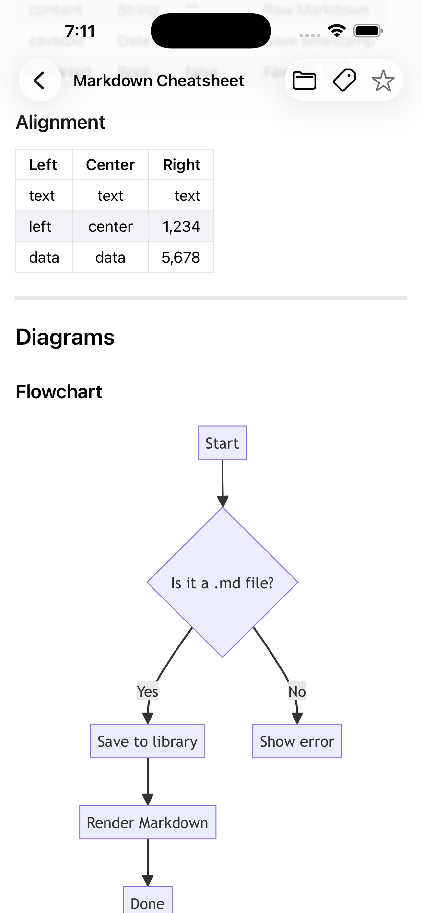
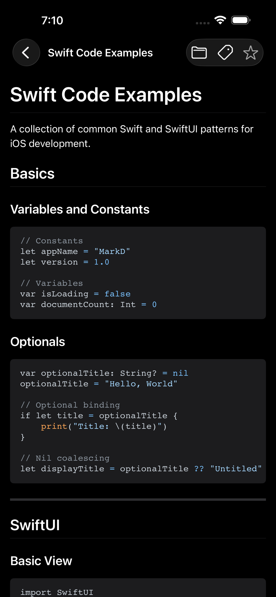

# MarkD — Markdown Viewer

  

  A clean, powerful Markdown viewer for iOS. 
  Read, organize, and visualize your documents beautifully.

  

---

## Features

- **Markdown Rendering** — Full support for headings, tables, code blocks, blockquotes, checkboxes, and more
- **Syntax Highlighting** — 40+ languages including Swift, Python, JavaScript, Go, Rust, and more
- **Mermaid Diagrams** — Flowcharts, sequence diagrams, class diagrams, ER diagrams, and Gantt charts rendered inline
- **Folders & Tags** — Organize documents by folder and tag for quick retrieval
- **File Format Support** — `.md`, `.html`, `.swift`, `.py`, `.js`, `.go`, `.json`, `.yaml`, `.txt`, and more
- **Files App Integration** — Open any file directly from the iOS Files app
- **Share Extension** — Save text or URLs from any app directly to your library
- **Dark Mode** — Fully optimized for both light and dark themes
- **Reading Info** — Word count and estimated reading time displayed automatically

## Screenshots

| Library | Viewer | Code |
|---------|--------|------|
|  |  |  |

## Requirements

- iOS 17.0 or later
- iPhone

## Support

Having trouble or have a question? We're here to help.

- **Email**: [eyaa.moment@gmail.com](mailto:eyaa.moment@gmail.com)
- **Issues**: [Open an issue](https://github.com/GukhyeonGyeong/MarkD-App/issues)

Please include the following when reporting a bug:
- iOS version
- Steps to reproduce the issue
- A screenshot if applicable

## Privacy Policy

MarkD does not collect any personal data. All documents are stored locally on your device using App Group storage shared between the app and Share Extension. No data is transmitted to external servers.

## FAQ

**Q. What file types does MarkD support?**  
A. MarkD supports `.md`, `.markdown`, `.html`, `.swift`, `.py`, `.js`, `.ts`, `.go`, `.rs`, `.java`, `.kt`, `.c`, `.cpp`, `.cs`, `.json`, `.yaml`, `.yml`, `.txt`, `.sh`, and more.

**Q. Can I import files from iCloud Drive?**  
A. Yes. Use the iOS Files app to open any file in MarkD, including files from iCloud Drive and other cloud storage providers.

**Q. Does MarkD support Mermaid diagrams?**  
A. Yes. Mermaid code blocks inside Markdown files are automatically detected and rendered as visual diagrams.

**Q. Is my data private?**  
A. Yes. All data is stored locally on your device. MarkD does not use any external servers or analytics.

---

  Made with ❤️ for developers who love Markdown

